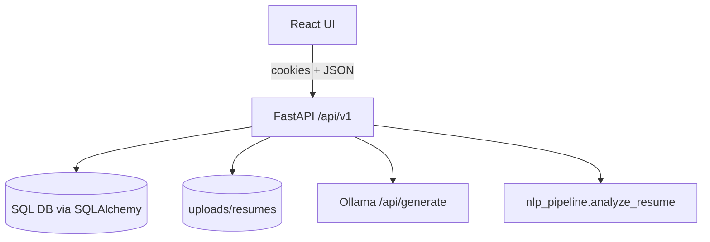
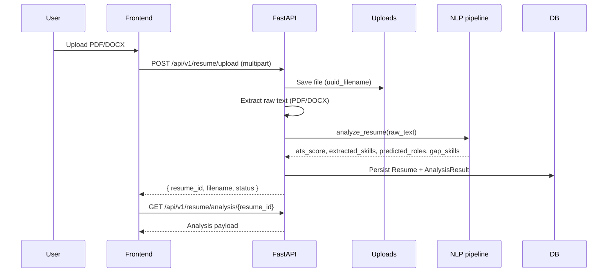
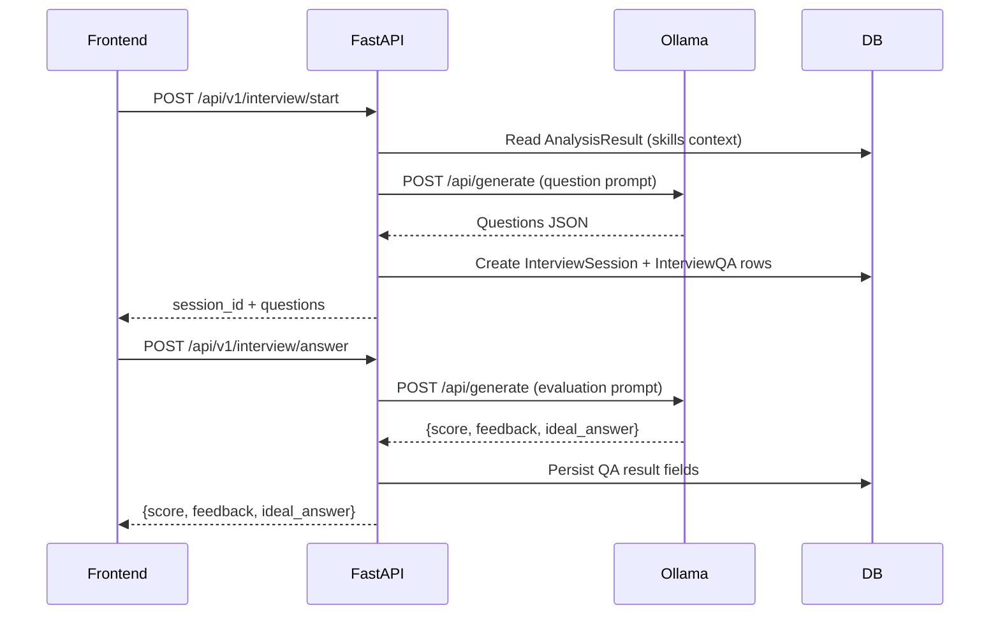

## AI Career Copilot — Project Overview

### Project goal
Help job seekers iterate faster by turning a resume into:
- **ATS-style score**
- **Detected skills**
- **Top role matches**
- **Actionable skill gaps**
- **Mock interview practice + feedback**

### System architecture (current implementation)
- **Frontend**: React + Vite + React Router, vanilla CSS UI system
- **Backend**: FastAPI with SQLAlchemy (default DB URL points to SQLite)
- **AI/NLP**:
  - **Skill embeddings**: Sentence-Transformers (`all-MiniLM-L6-v2`)
  - **NLP runtime**: spaCy (`en_core_web_sm`, must be installed up front)
  - **Interview coach**: Ollama (Llama 3) via HTTP (`/api/generate`)

### Core modules (backend)
- **Entry point**: `backend/app/main.py`
  - mounts routers: `auth`, `resume`, `interview`
  - CORS origins from `ALLOWED_ORIGINS`
  - simple `/health` endpoint
- **Auth**: `backend/app/api/v1/auth.py`
  - issues JWT and stores it in an **HttpOnly cookie** named `session`
  - `GET /auth/me` validates cookie and returns the current user
- **Resume service**: `backend/app/api/v1/resume.py`
  - validates file type (PDF/DOCX) and size (5MB)
  - saves file via `backend/app/services/file_service.py`
  - extracts text (PyMuPDF with pdfplumber fallback; python-docx for DOCX)
  - calls `backend/app/services/ai/nlp_pipeline.py`
  - persists `Resume` + `AnalysisResult`
- **Interview coach**: `backend/app/api/v1/interview.py` + `backend/app/services/ai/llm_coach.py`
  - `start`: generates interview questions (fallbacks if Ollama is unreachable)
  - `answer`: evaluates answer via Ollama (fallback response on error)

### Data model (DB)
The persisted entities are:
- **User** (`users`)
- **Resume** (`resumes`)
- **AnalysisResult** (`analysis`)
- **InterviewSession** + **InterviewQA** (`interview_sessions`, `interview_qa`)

### Resume upload + analysis flow

### Interview coach flow

### Security & operational notes
- **Session**: JWT stored in `session` cookie (`HttpOnly`, `SameSite=lax`).
- **CORS**: allowed origins are controlled by `ALLOWED_ORIGINS`.
- **Rate limiting**: SlowAPI limiter is wired in `backend/app/main.py` (enabled when `ENVIRONMENT=production`).

### Known constraints (documented, not changed here)
- **Startup latency**: skill embeddings are computed at import time in `nlp_pipeline.py`.
- **Database portability**: the repository includes Compose configs for Postgres, but the backend currently defaults to SQLite and does not include a Postgres driver in `backend/requirements.txt`.

### Where to go next
- Align the API contract docs under `docs/engineering/` with the current runtime payloads (cookie-based auth, analysis payload shapes).
- Production hardening: background workers for heavy analysis, observability, and DB driver + engine config for Postgres.
